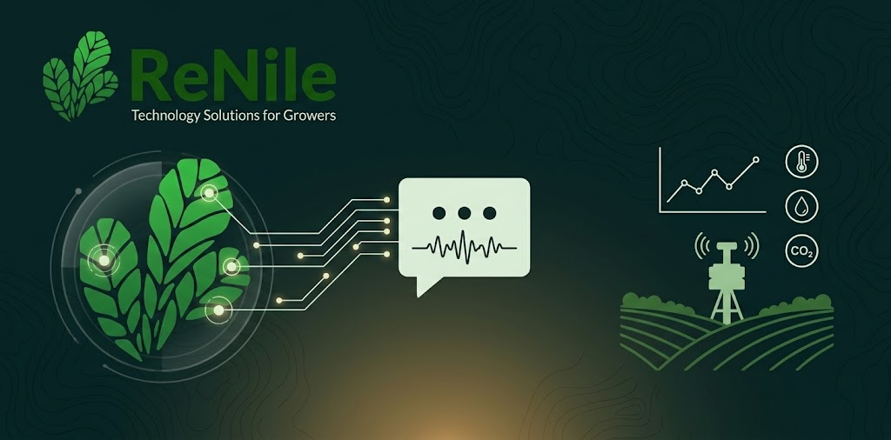

<p align="center">
  
</p>

# ReNile Farmer Assistant

Arabic-first AI agent for the [ReNile-IoT](https://renile-iot.com) platform, answering farmers' questions in Egyptian Arabic or English via text, voice, or plant photos.

Built on FastAPI, the agent calls backend tools to read live and historical ReNile device data, diagnoses plant diseases from images, and supports speech in and out.

## Features

- 🌱 **Plant disease diagnosis** — send a leaf photo, get the likely disease and advice.
- 📊 **Farm readings** — current device status, plus daily summaries and hourly history.
- 🎙️ **Voice in and out** — send a WAV, get a spoken reply back.
- 🧠 **Conversation memory** — Redis-backed follow-ups, with a separate cache for tool results.
- 🌍 **Bilingual** — replies in Egyptian Arabic or English, matching how the user wrote.

## Stack

Python 3.12 · FastAPI · OpenAI-compatible LLM · Redis · HTTPX · Cohere Transcribe Arabic (ASR, Faster-Whisper fallback) · VoiceTut (TTS) · Streamlit · pytest

## Quick Start

**Requirements:** Python `>=3.12,<3.13`, [`uv`](https://docs.astral.sh/uv/), Docker, an OpenAI-compatible LLM endpoint, and a ReNile JWT.

```bash
uv sync                                        # install dependencies
cp .env.example .env                           # then fill in your values
docker compose -f docker/compose.yaml up -d redis
uv run uvicorn main:app --reload               # http://localhost:8000
```

Check it's alive:

```bash
curl http://localhost:8000/health   # {"status":"ok"}
```

Then try it in the browser with the manual tester — enter the backend URL and your ReNile JWT in the sidebar:

```bash
uv run streamlit run streamlit_app.py
```

> **Note:** ASR/TTS models load at startup, so the first boot is slow. The Cohere ASR weights are gated on Hugging Face — accept the model conditions and set `HF_TOKEN` (or run `hf auth login`) first.

## API

One endpoint: `POST /api/v1/chat`. Full reference in [Farmer-Assistant-API-Doc.md](Farmer-Assistant-API-Doc.md).

**Text** — `application/json`:

```json
{
  "jwt": "<renile-jwt>",
  "conversation_id": "conversation-123",
  "message": "آخر قراءات المزرعة إيه؟"
}
```

**Voice or image** — `multipart/form-data` with `jwt`, `conversation_id`, and one of:

| Field | Notes |
| --- | --- |
| `message` | Plain text. |
| `wav_file` | WAV audio, transcribed then answered. Cannot be combined with the others. |
| `image_file` | `.jpg` / `.jpeg` / `.png` / `.webp`, optionally alongside `message`. |

**Response:**

```json
{
  "conversation_id": "conversation-123",
  "message": "...",
  "disease": "...",
  "source": "...",
  "audio_wav_base64": "...",
  "audio_content_type": "audio/wav"
}
```

`disease` and `source` appear only for image diagnoses; the audio fields only for voice requests.

The JWT is used by the backend to call ReNile APIs. It is never exposed to the LLM, prompts, memory, or logs.

## Configuration

All settings come from `.env` — see [`.env.example`](.env.example) for the full annotated list. Every key is required; a missing one fails at startup rather than silently defaulting.

The ones you'll usually change:

| Key | Purpose |
| --- | --- |
| `LLM_BASE_URL`, `LLM_MODEL` | Your OpenAI-compatible LLM server. |
| `REDIS_URL`, `REDIS_TOOL_CACHE_URL` | Conversation memory (DB 0) and tool cache (DB 1). |
| `RENILE_API_BASE_URL` | ReNile platform API. |
| `PLANT_DISEASE_API_BASE_URL` | Plant disease prediction service. |
| `ASR_PROVIDER` | `cohere` (default) or `faster_whisper`. |
| `ASR_DEVICE`, `TTS_DEVICE` | Where the speech models run, e.g. `cuda:0` or `cpu`. |
| `CHAT_API_BASE_URL` | Backend URL used by the Streamlit tester. |

## How It Works

```
request ──▶ parse (JSON / audio / image) ──▶ agent loop ──▶ response (+ TTS)
                                               │
                                               ├─ current readings  ──┐
                                               ├─ historical data   ──┼─▶ ReNile API
                                               ├─ device lookup     ──┘
                                               └─ plant diagnosis   ───▶ Disease API
```

The agent runs a bounded tool-calling loop against the LLM. Historical questions always resolve a real device ID first, and tool results are cached in Redis so repeat questions don't re-hit ReNile. Readings before 2026-01-01 are out of range, and off-topic questions are declined.

## Development

```bash
uv run pytest                                  # all tests
uv run pytest tests/test_tools.py::test_name   # one test
uv run python -m compileall src                # syntax check
```

Tests use fakes throughout — no live Redis, LLM, or external APIs needed.

Project layout, architecture notes, and the rules to follow when changing the agent live in [AGENTS.md](AGENTS.md) and [CLAUDE.md](CLAUDE.md).
